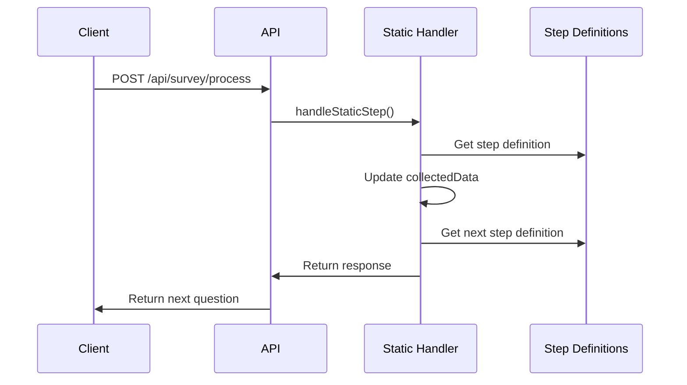
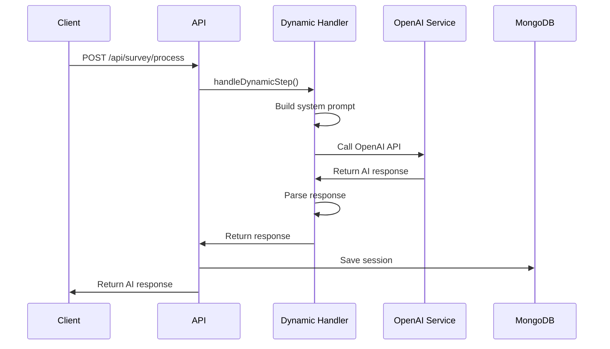

# API-Design & REST Endpoints

## 🌐 API-Übersicht

Das MSQ Survey System verwendet **Next.js API Routes** für alle Backend-Funktionalitäten. Die API ist RESTful designed und unterstützt JSON-basierte Kommunikation.

## 📍 Base URL

- **Development**: `http://localhost:7016`
- **Production**: `https://survey.plygrnd.tech`

## 🔗 Endpoints

### 1. Survey Initialization

#### `POST /api/survey/init`

Initialisiert eine neue Survey-Session.

**Request:**
```json
{
  "action": "init",
  "timestamp": 1703123456789
}
```

**Response:**
```json
{
  "userId": "user_1234567890_abcdef",
  "assistantMessage": "Welcome! 👋 Before we start, here's what this survey is all about:",
  "component": {
    "type": "info-message",
    "props": {
      "message": "**Welcome to the MSQ Workflow Survey**...",
      "requiresAcknowledgement": true
    }
  },
  "conversationState": {
    "currentPhase": "intro",
    "currentStep": "intro",
    "collectedData": {},
    "validationHistory": []
  },
  "isComplete": false
}
```

**Status Codes:**
- `200` - Success
- `500` - Internal Server Error

---

### 2. Survey Processing

#### `POST /api/survey/process`

Verarbeitet User-Responses und gibt nächste Frage zurück.

**Request:**
```json
{
  "userId": "user_1234567890_abcdef",
  "message": "UDG",
  "conversationState": {
    "currentPhase": "intro",
    "currentStep": "greeting_agency",
    "collectedData": {},
    "validationHistory": []
  },
  "userResponse": "UDG",
  "timestamp": 1703123456789
}
```

**Response:**
```json
{
  "assistantMessage": "Great! Which team/department are you in?",
  "component": {
    "type": "button-group",
    "props": {
      "options": [
        {"label": "Technology & Development", "value": "Technology & Development"},
        {"label": "UX/UI Design", "value": "UX/UI Design"},
        {"label": "Other", "value": "other"}
      ],
      "multiple": false,
      "columns": 2
    }
  },
  "conversationState": {
    "currentPhase": "phase1",
    "currentStep": "department",
    "collectedData": {
      "greeting_agency": "UDG"
    },
    "validationHistory": []
  },
  "isComplete": false
}
```

**Status Codes:**
- `200` - Success
- `400` - Bad Request (Missing fields)
- `500` - Internal Server Error

---

### 3. Health Check

#### `GET /api/health`

Überprüft die System-Gesundheit.

**Request:**
```
GET /api/health
```

**Response:**
```json
{
  "status": "healthy",
  "timestamp": "2024-01-01T12:00:00.000Z",
  "services": {
    "mongodb": "connected",
    "openai": "available"
  },
  "version": "1.0.0"
}
```

**Status Codes:**
- `200` - Healthy
- `503` - Service Unavailable

---

### 4. Voice Token (Debug Mode)

#### `GET /api/voice/token`

Generiert Token für Voice-Features (nur im Debug-Modus).

**Request:**
```
GET /api/voice/token
```

**Response:**
```json
{
  "token": "voice_token_123456789",
  "expires": 1703123456789
}
```

**Status Codes:**
- `200` - Success
- `404` - Not Found (Debug mode disabled)

---

## 📊 Request/Response Schemas

### Common Types

```typescript
// Base Message Interface
interface Message {
  id: string;
  role: 'user' | 'assistant';
  content: string;
  timestamp: number;
  isManifestBased?: boolean;
  manifestComponent?: {
    componentConfig: ComponentConfig;
    stepId: string;
    phaseId: string;
  };
  conversationState?: ConversationState;
}

// Conversation State
interface ConversationState {
  currentPhase: string;
  currentStep: string;
  collectedData: Record<string, any>;
  validationHistory: ValidationError[];
  iterationState?: {
    currentPhase: string;
    completedPhases: string[];
  };
}

// Component Configuration
interface ComponentConfig {
  type: string;
  props: Record<string, any>;
}

// Step Response
interface StepResponse {
  assistantMessage: string;
  component?: ComponentConfig;
  nextStep: string;
  conversationState: ConversationState;
  isComplete?: boolean;
  skipGPT?: boolean;
}
```

### Error Response Schema

```typescript
interface ErrorResponse {
  error: string;
  details?: string;
  code?: string;
  timestamp: string;
}
```

## 🔄 API Flow Patterns

### 1. Static Step Flow



### 2. Dynamic Step Flow



## 🛡️ Security & Validation

### Input Validation

```typescript
// Request validation
const validateRequest = (req: NextRequest) => {
  const { userId, userResponse, conversationState } = req.body;
  
  if (!userId || typeof userId !== 'string') {
    throw new Error('Invalid userId');
  }
  
  if (!conversationState || typeof conversationState !== 'object') {
    throw new Error('Invalid conversationState');
  }
  
  return { userId, userResponse, conversationState };
};
```

### Response Sanitization

```typescript
// Sanitize response data
const sanitizeResponse = (response: StepResponse) => {
  return {
    assistantMessage: response.assistantMessage,
    component: response.component,
    conversationState: {
      currentPhase: response.conversationState.currentPhase,
      currentStep: response.conversationState.currentStep,
      collectedData: response.conversationState.collectedData,
      validationHistory: response.conversationState.validationHistory
    },
    isComplete: response.isComplete || false
  };
};
```

## 📈 Rate Limiting & Caching

### Rate Limiting (Optional)

```typescript
// Rate limiting middleware
const rateLimit = new Map();

const checkRateLimit = (userId: string) => {
  const now = Date.now();
  const userRequests = rateLimit.get(userId) || [];
  
  // Remove requests older than 1 minute
  const recentRequests = userRequests.filter(
    (time: number) => now - time < 60000
  );
  
  if (recentRequests.length >= 10) {
    throw new Error('Rate limit exceeded');
  }
  
  recentRequests.push(now);
  rateLimit.set(userId, recentRequests);
};
```

### Response Caching

```typescript
// Cache AI responses
const responseCache = new Map();

const getCachedResponse = (cacheKey: string) => {
  const cached = responseCache.get(cacheKey);
  if (cached && Date.now() - cached.timestamp < 3600000) {
    return cached.data;
  }
  return null;
};

const setCachedResponse = (cacheKey: string, data: any) => {
  responseCache.set(cacheKey, {
    data,
    timestamp: Date.now()
  });
};
```

## 🔍 Error Handling

### Error Types

```typescript
enum ErrorType {
  VALIDATION_ERROR = 'VALIDATION_ERROR',
  PROCESSING_ERROR = 'PROCESSING_ERROR',
  AI_SERVICE_ERROR = 'AI_SERVICE_ERROR',
  DATABASE_ERROR = 'DATABASE_ERROR',
  RATE_LIMIT_ERROR = 'RATE_LIMIT_ERROR'
}

// Error response factory
const createErrorResponse = (type: ErrorType, message: string, details?: string) => {
  return NextResponse.json(
    {
      error: message,
      type,
      details,
      timestamp: new Date().toISOString()
    },
    { status: getErrorStatus(type) }
  );
};
```

### Error Status Mapping

```typescript
const getErrorStatus = (type: ErrorType): number => {
  switch (type) {
    case ErrorType.VALIDATION_ERROR:
      return 400;
    case ErrorType.PROCESSING_ERROR:
      return 500;
    case ErrorType.AI_SERVICE_ERROR:
      return 502;
    case ErrorType.DATABASE_ERROR:
      return 503;
    case ErrorType.RATE_LIMIT_ERROR:
      return 429;
    default:
      return 500;
  }
};
```

## 📊 Monitoring & Logging

### Request Logging

```typescript
// Request logging middleware
const logRequest = (req: NextRequest, response: NextResponse) => {
  console.log({
    method: req.method,
    url: req.url,
    status: response.status,
    timestamp: new Date().toISOString(),
    userAgent: req.headers.get('user-agent'),
    ip: req.headers.get('x-forwarded-for') || req.ip
  });
};
```

### Performance Metrics

```typescript
// Performance tracking
const trackPerformance = (startTime: number, endpoint: string) => {
  const duration = Date.now() - startTime;
  
  console.log({
    endpoint,
    duration,
    timestamp: new Date().toISOString()
  });
  
  // Send to monitoring service
  if (duration > 5000) {
    console.warn(`Slow response detected: ${endpoint} took ${duration}ms`);
  }
};
```

## 🔄 WebSocket Support (Optional)

### WebSocket Endpoint

```typescript
// WebSocket for real-time updates
export async function GET(req: NextRequest) {
  if (req.headers.get('upgrade') !== 'websocket') {
    return new Response('Expected websocket', { status: 400 });
  }
  
  const { socket, response } = upgradeWebSocket(req);
  
  socket.onopen = () => {
    console.log('WebSocket connection opened');
  };
  
  socket.onmessage = (event) => {
    // Handle incoming messages
    const data = JSON.parse(event.data);
    handleWebSocketMessage(socket, data);
  };
  
  return response;
}
```

## 📱 Mobile API Support

### Mobile-specific Headers

```typescript
// Mobile detection and optimization
const isMobile = (req: NextRequest) => {
  const userAgent = req.headers.get('user-agent') || '';
  return /Mobile|Android|iPhone|iPad/.test(userAgent);
};

const optimizeForMobile = (response: any, isMobile: boolean) => {
  if (isMobile) {
    // Reduce component complexity for mobile
    if (response.component?.type === 'percentage-table') {
      response.component.props.columns = 1;
    }
  }
  return response;
};
```

---

**Nächste Schritte**: Siehe [UI-Komponenten](../components/ui-components.md) für Frontend-Komponenten-Dokumentation.