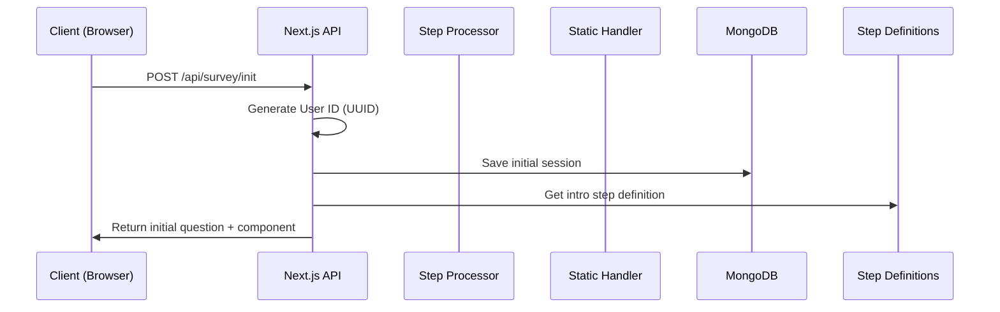
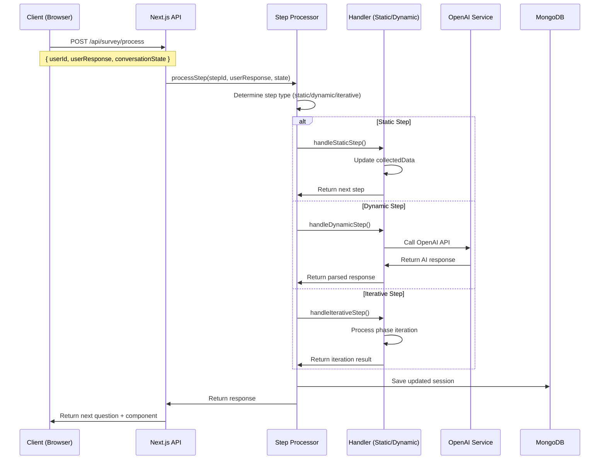
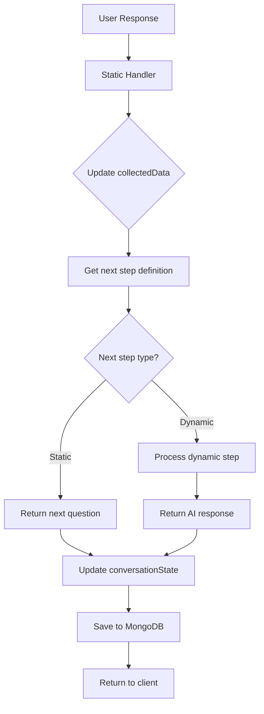
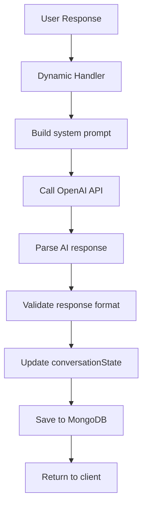
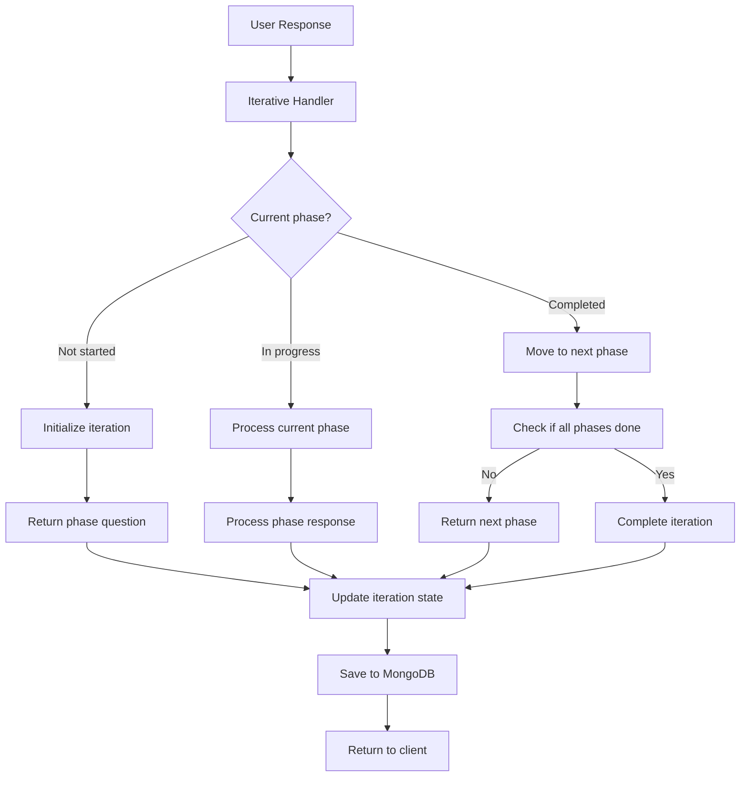

# Datenfluss & Request/Response-Flows

## 🔄 Übersicht

Dieses Dokument beschreibt die detaillierten Datenflüsse im MSQ Survey System - von der Client-Interaktion bis zur Datenbank-Speicherung.

## 📊 Haupt-Datenflüsse

### 1. Survey Initialization Flow



**Detaillierter Flow:**
1. **Client** sendet POST Request an `/api/survey/init`
2. **API Route** generiert eindeutige User ID (UUID)
3. **MongoDB Service** speichert initiale Session
4. **Step Definitions** liefert Intro-Step Konfiguration
5. **Response** enthält erste Frage + UI-Komponente

### 2. User Response Processing Flow



## 🧩 State Management Flow

### Client-Side State (Zustand Store)

```typescript
// State Update Flow
const useChatStore = create<ChatState>((set, get) => ({
  // 1. User Interaction
  sendResponse: async (value) => {
    // 2. Clear current component
    set({ currentComponent: null });
    
    // 3. Add user message
    addMessage(userMessage);
    
    // 4. Call API
    const response = await sendManifestMessage(...);
    
    // 5. Update state
    set({
      conversationState: response.conversationState,
      currentStep: response.conversationState.currentStep,
      progress: calculateProgress(...),
      surveyData: response.conversationState.collectedData,
    });
  }
}));
```

### Server-Side State (MongoDB)

```typescript
// Session Update Flow
interface SurveySession {
  userId: string;
  conversationState: ConversationState;
  createdAt: Date;
  updatedAt: Date;
}

// Update Process
1. Receive user response
2. Process step logic
3. Update conversationState
4. Save to MongoDB
5. Return updated state
```

## 🔄 Step Processing Flow

### Static Steps (11 Steps)



### Dynamic Steps (5 AI Steps)



### Iterative Steps (Phase-based)



## 📊 Data Transformation Flow

### Input Validation

```typescript
// Client-side validation
const validateResponse = (value: any, component: ComponentConfig) => {
  switch (component.type) {
    case 'button-group':
      return validateButtonGroup(value, component.props);
    case 'multi-select':
      return validateMultiSelect(value, component.props);
    case 'percentage-table':
      return validatePercentageTable(value, component.props);
    // ... other validations
  }
};
```

### Response Processing

```typescript
// Server-side processing
const processUserResponse = (userResponse: any, stepDef: StepDefinition) => {
  // 1. Validate input
  const validation = validateInput(userResponse, stepDef);
  if (!validation.valid) {
    return { error: validation.message };
  }
  
  // 2. Transform data
  const transformedData = transformResponse(userResponse, stepDef);
  
  // 3. Update state
  const updatedState = updateConversationState(transformedData);
  
  // 4. Return result
  return { success: true, data: updatedState };
};
```

## 🔄 Error Handling Flow

### Client-Side Error Handling

```typescript
// Error handling in Zustand store
sendResponse: async (value) => {
  try {
    setLoading(true);
    setError(null);
    
    const response = await sendManifestMessage(...);
    
    // Process successful response
    updateState(response);
    
  } catch (error) {
    const errorMessage = handleApiError(error);
    setError(errorMessage);
    console.error('Error sending response:', error);
  } finally {
    setLoading(false);
  }
}
```

### Server-Side Error Handling

```typescript
// Error handling in API routes
export async function POST(req: NextRequest) {
  try {
    const result = await processStep(stepId, userResponse, conversationState);
    return NextResponse.json(result);
  } catch (error) {
    console.error('Error in process route:', error);
    return NextResponse.json(
      { error: 'Failed to process step', details: error.message },
      { status: 500 }
    );
  }
}
```

## 📈 Progress Calculation Flow

### Progress Calculation Logic

```typescript
// Progress calculation based on phase and step
const calculateProgress = (
  currentPhase: string,
  currentStep: string,
  iterationState?: IterationState
): number => {
  const phaseWeights = {
    'intro': 0,
    'phase1': 20,
    'phase2': 40,
    'phase3': 60,
    'phase4': 80,
    'phase5': 90,
    'phase6': 100
  };
  
  const stepProgress = getStepProgress(currentStep, currentPhase);
  const phaseProgress = phaseWeights[currentPhase] || 0;
  
  return Math.min(phaseProgress + stepProgress, 100);
};
```

## 🔄 Back Navigation Flow

### Back Button Logic

```typescript
// Back navigation in Zustand store
goBack: () => {
  const { messages } = get();
  
  // Remove last 2 messages (user + assistant)
  const newMessages = messages.slice(0, -2);
  
  // Get previous assistant message
  const previousMessage = newMessages[newMessages.length - 1];
  
  // Restore state from previous message
  set({
    messages: newMessages,
    conversationState: previousMessage.conversationState,
    currentStep: previousMessage.conversationState.currentStep,
    progress: calculateProgress(...),
  });
}
```

## 💾 Data Persistence Flow

### LocalStorage Persistence

```typescript
// Auto-save every 30 seconds
setInterval(() => {
  const store = useChatStore.getState();
  if (store.messages.length > 0 && !store.isLoading) {
    store.saveToLocalStorage();
  }
}, 30000);

// Save on every state change
const saveToLocalStorage = () => {
  const data = {
    messages,
    surveyData,
    progress,
    currentStep,
    conversationState,
    userId,
    isComplete,
    timestamp: Date.now(),
  };
  localStorage.setItem(STORAGE_KEY, JSON.stringify(data));
};
```

### MongoDB Persistence

```typescript
// Session persistence
const saveSession = async (userId: string, conversationState: ConversationState) => {
  await db.collection('sessions').updateOne(
    { userId },
    { 
      $set: { 
        conversationState, 
        updatedAt: new Date() 
      } 
    },
    { upsert: true }
  );
};

// Result persistence
const saveSurveyResult = async (userId: string, collectedData: Record<string, any>) => {
  await db.collection('results').insertOne({
    userId,
    collectedData,
    completedAt: new Date(),
    metadata: {
      userAgent: req.headers['user-agent'],
      duration: Date.now() - sessionStartTime,
    }
  });
};
```

## 🔄 Real-time Updates Flow

### WebSocket Integration (Optional)

```typescript
// Real-time updates via WebSocket
const useRealtimeService = () => {
  useEffect(() => {
    const ws = new WebSocket('ws://localhost:7016/ws');
    
    ws.onmessage = (event) => {
      const update = JSON.parse(event.data);
      updateChatState(update);
    };
    
    return () => ws.close();
  }, []);
};
```

## 📊 Analytics Flow

### User Interaction Tracking

```typescript
// Track user interactions
const trackInteraction = (action: string, data: any) => {
  // Send to analytics service
  analytics.track('survey_interaction', {
    action,
    data,
    userId: getUserId(),
    timestamp: Date.now(),
  });
};

// Track step completion
const trackStepCompletion = (stepId: string, duration: number) => {
  analytics.track('step_completed', {
    stepId,
    duration,
    userId: getUserId(),
  });
};
```

## 🔄 Caching Flow

### Response Caching

```typescript
// Cache AI responses
const cacheKey = `ai_response_${stepId}_${JSON.stringify(userResponse)}`;
const cachedResponse = cache.get(cacheKey);

if (cachedResponse) {
  return cachedResponse;
}

const response = await callOpenAI(systemPrompt, userPrompt);
cache.set(cacheKey, response, 3600); // 1 hour TTL
return response;
```

---

**Nächste Schritte**: Siehe [API-Design](api-design.md) für detaillierte API-Spezifikationen.